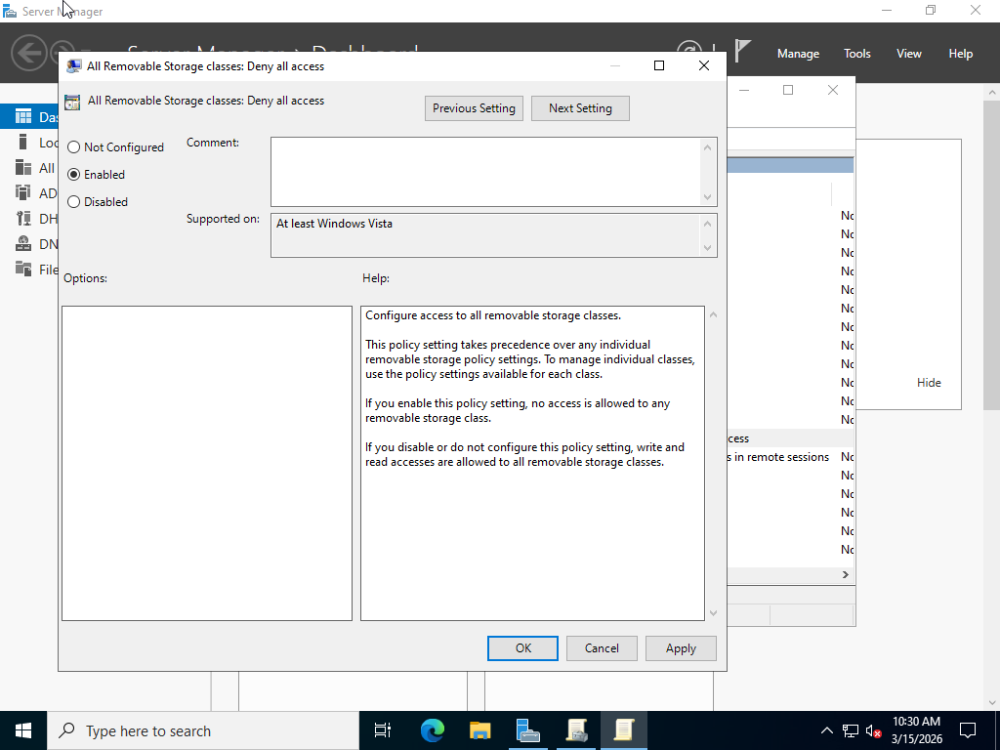
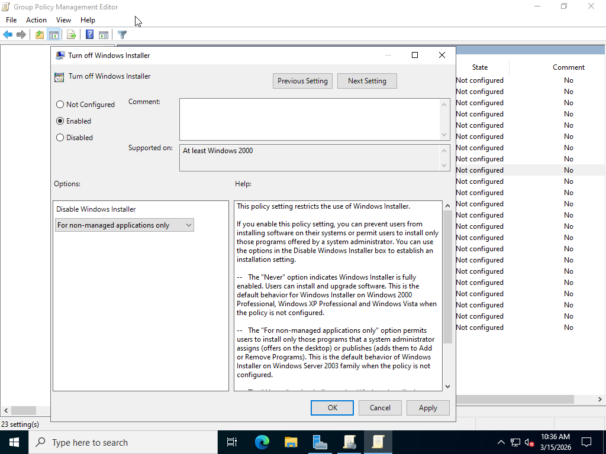
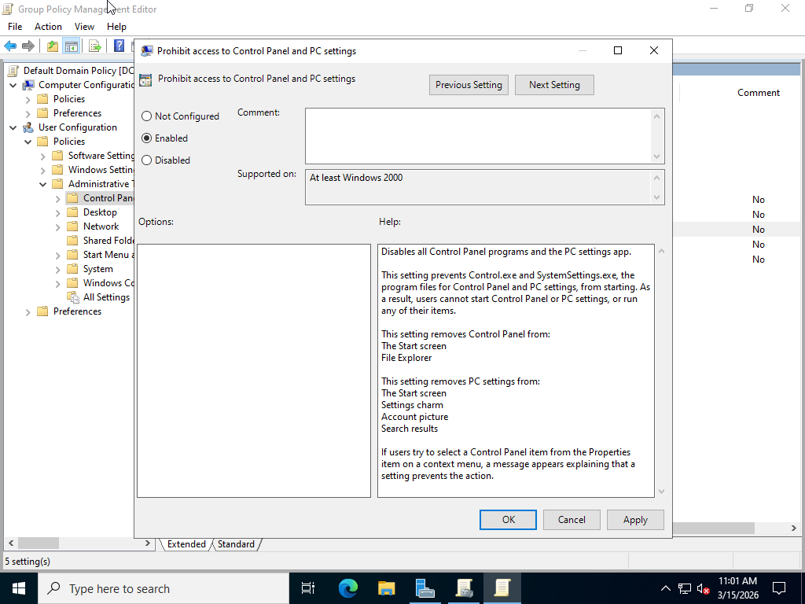
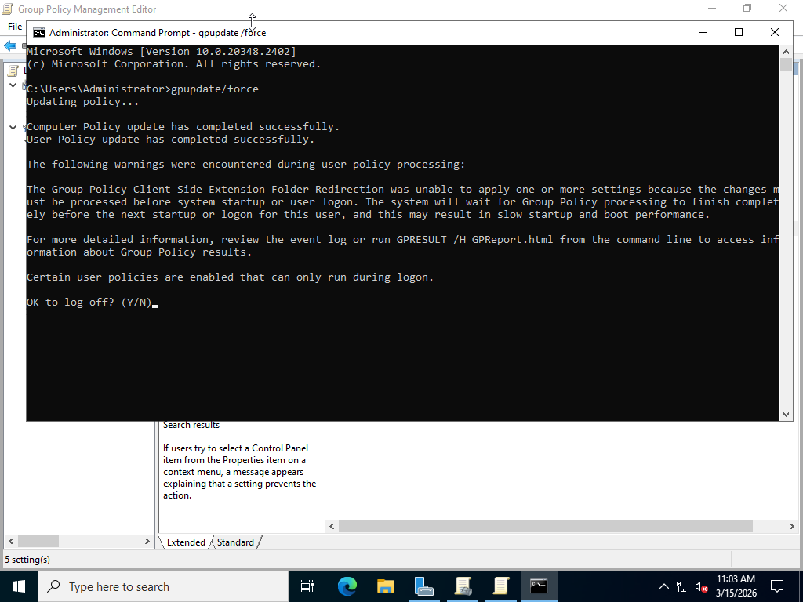

# AD-Security-Hardening-Lab
# Active Directory Security Hardening Lab

## Overview

This lab demonstrates how to apply basic security hardening techniques in an Active Directory environment using Group Policy.

Security hardening helps protect domain computers from unauthorized access and reduces potential attack surfaces.

---

## Lab Environment

Domain Controller: DC01  
Domain: OneWay.local  
Client Machine: Windows 10  

Technologies Used:

- Windows Server 2022
- Active Directory
- Group Policy

---

## Configuration Steps

### 1. Block USB Storage Devices

Open:

Group Policy Management  
Default Domain Policy → Edit

Navigate to:

Computer Configuration  
Policies  
Administrative Templates  
System  
Removable Storage Access

Enable the following policy:

All Removable Storage classes: Deny all access

---

### 2. Disable Windows Installer

Navigate to:

Computer Configuration  
Policies  
Administrative Templates  
Windows Components  
Windows Installer

Configure:

Disable Windows Installer → Enabled → Always

This prevents standard users from installing software.

---

### 3. Block Control Panel Access

Navigate to:

User Configuration  
Policies  
Administrative Templates  
Control Panel

Enable:

Prohibit access to Control Panel

---

## Apply Policy
  gpupdate/force

---

## Testing

After applying the policy:

- USB storage devices should not be accessible.
- Users should not be able to open the Control Panel.
- Standard users should not be able to install software.

---

## Screenshots

### USB Storage Policy

### Windows Installer Disabled

### Control Panel Blocked

### Group Policy Update

---

## Result

Security hardening policies were successfully applied through Group Policy.

These configurations help improve the security posture of domain computers by restricting unauthorized actions and reducing security risks.

Run on the client computer:
